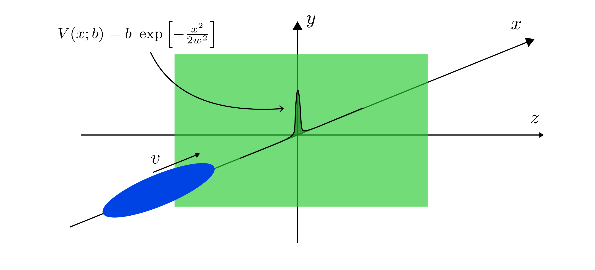

# SolitonDynamics.jl
A solver for the 3D Gross-Pitaevskii equation (GPE) and quasi-one-dimensional effective equations derived from it.
The physical problem is the scattering of a matter-wave soliton from a thin potential barrier. The results are collected in the paper [arXiv:2310.02018](https://browse.arxiv.org/abs/2310.02018).



## Purpose of the solver
- [x] Find the soliton-like ground state of all the equations 
- [x] Using the soliton ground state, solve the dynamics of a collision with a narrow barrier
- [x] Compare the transmission coefficient and the regions of barrier-induced collapse
  
## Featured equations
- 3D-GPE, with GPU support
```math
      i \dfrac{\partial}{\partial t}\psi = \left[-\dfrac{1}{2} \nabla^2 + U  + g(N-1)|\psi|^2\right]\psi.
```
where $U(x, y, z)$ is the external potential, composed of a tight transverse harmonic part and a axial barrier term $V(x)$.
- Nonpolynomial Schrodinger equation (NPSE)
```math
      i  \frac{\partial}{\partial t} f = \bigg[- \frac{1}{2} \frac{\partial^2}{\partial x^2} + V +\frac{1}{2\sigma^2} + \frac{1}{2}\sigma^2 + \frac{g(N-1)}{2\pi \sigma^2}|f|^2 \bigg]f,
```
```math
      \sigma^2 = \sqrt{1+ 2a_s(N-1)|f|^2}.
```

- NPSE+, i.e. the exact solution to the variational NPSE problem
```math
      i \frac{\partial}{\partial t} f = \bigg[- \frac{1}{2} \frac{\partial^2}{\partial x^2} + V + \frac{1}{2\sigma^2}\left(1+ \left(\frac{\partial}{\partial x} \sigma\right)^2 \right) +\frac{1}{2}\sigma^2 + \frac{g(N-1)}{2\pi\sigma^2}|f|^2 \bigg] f,
```
```math
          \sigma^4 - \left[1 + 2a_s{(N-1)}|f|^2\right]
          +\left[\sigma \frac{\partial^2}{\partial x^2} \sigma -\left(\frac{\partial}{\partial x}\sigma\right)^2 +\sigma \frac{\partial}{\partial x}\sigma \frac{1}{|f|^2}\frac{\partial}{\partial x} |f|^2 \right] = 0.
```
- 1D-GPE
```math
    i \dfrac{\partial}{\partial t}f = \left[-\dfrac{1}{2}\dfrac{\partial^2}{\partial x^2} + V + 1 + g_{1D}|f|^2\right]f
```

## Numerical methods
- Split-step Fourier Method (SSFM) with Strang splitting, in one and three spatial dimensions.